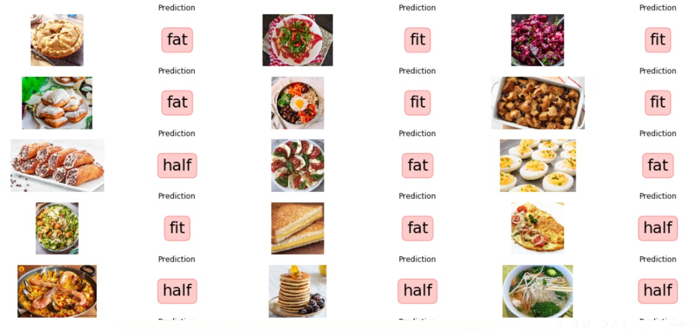

# FIT OR FAT

En este repositorio esta alojado el juego **FIT-OR-FAT** un proyecto que se creo con la intención de aplicar los conceptos aprendidos en el curso de **Procesamiento Digital de Imagen**.

El proyecto consiste en la construcción de un clasificador multiclase que permitirá determinar si una imagen con un alimento pertenece a 1 de los 3 tipos, entre los cuales se encuentra **FIT, FAT, HALF**. Dicho clasficiador se entrena con un conjunto de datos de aproximadamenter 60 mil imagenes. Es importante mencionar que a cada una delas imagenes se les extrae el vector caracteristico de Halarick con el cual será posible entrenar y realizar inferencias sobre el modelo.

.

## Project Structure

```
- Imagenes/
- config.yml
- Experimentacion.ipynb
- extract_features.py
- preprocessing.py
- Resultados.ipynb
- utils.py
```

La estructura anterior contiene la siguiente información

* **Imagenes:** Aquí se guardan todas las imagenes del proyecto.
* **config:** Archivo de configuración que tiene los parámetros con los cuales se generará el entrenamiento.
* **Experimentacion:** Notebook que muestra el paso a paso de experimentación del proyecto.
* **extract_features:** Script que permite extraer los componentes de textura de las imagenes.
* **preprocessing:** Script con el cual se puede preprocesar todos los datos, incluye desde descarga y descompresión así como generación de carpetas y dataset.
* **Resultados:** Notebook que muestra el resultado final de entrenamiento e inferencia del proyecto.
* **utils:** Funicones transversales que ayudan al preprocesamiento y extracción de caracteristicas.

## Como usar

Para usar y probar el juego se deben seguir los siguientes pasos.

1) **Clonar el repositorio:** En una consola ejecutamos los siguientes comandos.
```
git clone https://github.com/SebasPelaez/fit-or-fat.git
cd fit-or-fat
```

2) **Crear ambiente de python:** Para crear y activar el ambiente con el cual correra nuestro proyecto debemos seguir los siguientes comandos
```
pip install virtualenv
virtualenv nombre_de_tu_entorno
nombre_de_tu_entorno\Scripts\activate
```

3) **Instalar todos los paquetes:** Para que el juego funcione correctamente se deben instalar todas las librerias del archivo _requirements.txt_
```
pip install -r requirements.txt
```

4) **Ejecutar el preprocesamiento:** Luego de correr correctamente los pasos anteriores, debemos ejecutar el siguiente comando para poder descargar los datos.
```
python preprocessing.py
```


## Referencias

> Gonzales, R. C., & Woods, R. E. (2002). Digital image processing: Colors Models. (p289)

> Russ, J. C. (2007). The image processing handbook: Processing Binary Images. CRC. Boca Raton, FL.

> Green, B. (2002). Canny edge detection tutorial. Retrieved: March, 6, 2005.

> Gonzales, R. C., & Woods, R. E. (2002). Digital image processing: Morphological Image Preprocessing. (p289)

> Rosebrock, A. (2016). Intersection over Union (IoU) for object detection. Diambil kembali dari PYImageSearch: https://www.pyimagesearch.com/2016/11/07/intersection-over-union-iou-for-object-detection.

> Akshay L Chandra.  (2018).  Tutorial: Webcam paint application Using OpenCV. Recuperado de https://towardsdatascience.com/tutorial-webcam-paint-opencv-dbe356ab5d6c

> Kumar, R. (Julio 20, 2019). Paint-application--Opencv. Github:rajan9519/Paint-application--Opencv: Recuperado de_ https://github.com/rajan9519/Paint-application--Opencv
